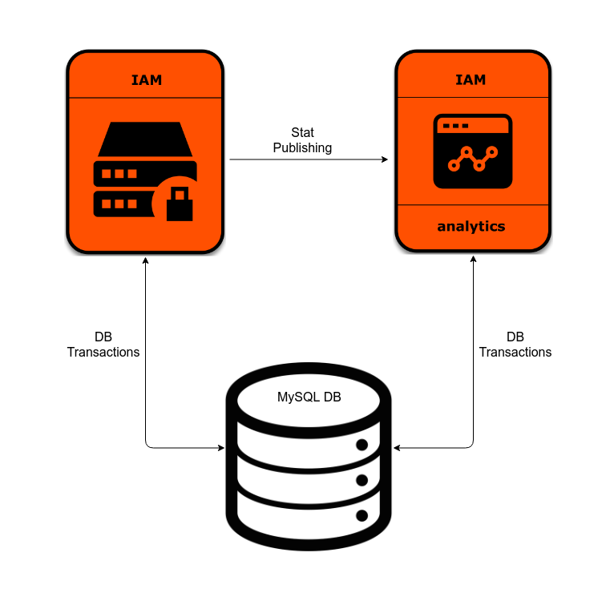

# Vagrantfile for WSO2 Identity Server

In order to use Vagrant boxes, you will need an active subscription from WSO2 since the Vagrant boxes hosted at vagrant.wso2.com contains the latest updates and fixes to WSO2 Identity Server. You can sign up for a Free Trial Subscription [here].(https://wso2.com/free-trial-subscription)

If you wish to use the Vagrant boxes without updates, please build them from [here].(https://github.com/wso2/vagrant-boxes)

This section defines the procedure to execute Vagrant resources for a setup of WSO2 Identity Server single
node with Analytics support.<br>



Please note that in order to run these Vagrant resources use, you need to install
[Oracle VM VirtualBox](http://www.oracle.com/technetwork/server-storage/virtualbox/downloads/index.html)
since, Vagrant uses Oracle VM VirtualBox as the default provider. In addition, you need to download the official JDBC driver
for MySQL, [Connector/J](https://dev.mysql.com/downloads/connector/j/5.1.html).

## How to run the Vagrantfile

1. Follow the instructions in this repository to build the WSO2 Identity Server 5.4.1, WSO2 Identity Server Analytics 5.4.1, and MySQL Vagrant boxes.

```
	https://github.com/wso2/vagrant-boxes
```

2. Checkout this repository into your local machine using the following Git command.

```
	git clone https://github.com/wso2/vagrant-is.git
```

3. Move to `vagrant-is` folder.

```
	cd vagrant-is
```

4. Spawn up the Vagrant setup.

```
	vagrant up
```
5. Access the Identity Server and Identity Server Analytics via the URLs given below.

```
For Identity Server - https://localhost:9443/carbon
For Identity Server Analytics - https://localhost:9444/carbon
```
