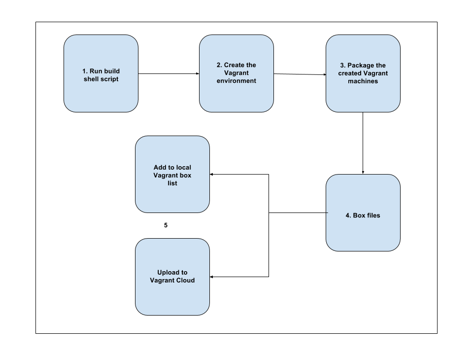

# Vagrant box generation

This section defines the procedure to build Vagrant boxes required for WSO2 Identity Server 5.4.0 single node
deployment with Analytics support.

Please note that in order to build these Vagrant boxes, you need to install
[Oracle VM VirtualBox](http://www.oracle.com/technetwork/server-storage/virtualbox/downloads/index.html),
as WSO2 Vagrant resources use Oracle VM VirtualBox, as the default provider.

## How to build the Vagrant boxes



##### 1. Checkout this repository into your local machine using the following Git command.
```
git clone https://github.com/wso2-incubator/vagrant-is.git
```

##### 2. Move to `boxes` folder.

    cd boxes

##### 3. Execute the build.sh shell script.

    ./build.sh
    
##### 4. Add created box files to local Vagrant box cache.

The created box files can be found in the output directory. In order to add a created box to the local Vagrant box cache use the `vagrant box add` command.

    vagrant box add <BOX_NAME> <BOX_FILE_PATH>

An example for adding the created WSO2 Identity Server Vagrant box file (by default, defined
within the `config.yaml` file) is as follows:
    
    vagrant box add wso2is output/wso2is.box
