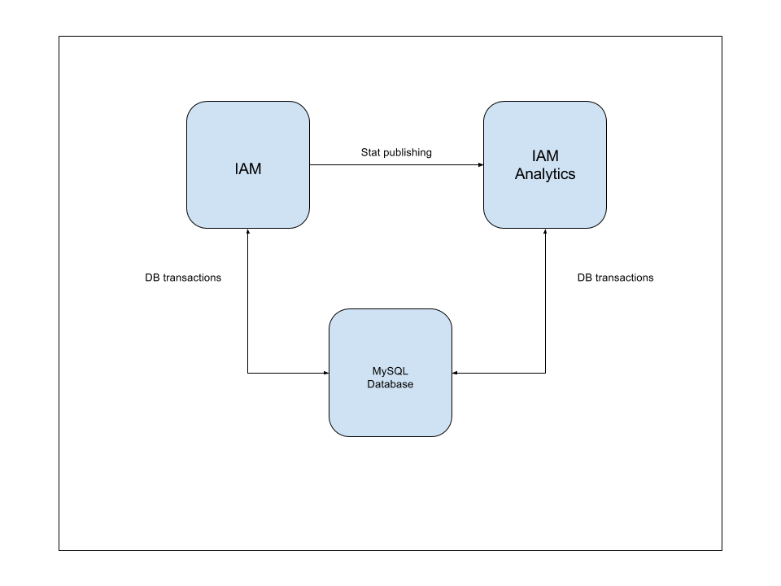

# Vagrantfile for WSO2 Identity Server

This section defines the procedure to execute run Vagrant resources for a setup of WSO2 Identity Server single
node with Analytics support.<br>



Please note that in order to run these Vagrant resources use, you need to install
[Oracle VM VirtualBox](http://www.oracle.com/technetwork/server-storage/virtualbox/downloads/index.html)
since, Vagrant uses Oracle VM VirtualBox as the default provider.

## How to run the Vagrantfile

##### 1. Checkout this repository into your local machine using the following Git command.
```
git clone https://github.com/wso2-incubator/vagrant-is.git
```

##### 2. Build and add the Vagrant boxes for external MySQL database, WSO2 Identity Server and WSO2 Identity Server Analytics using the Vagrant box automation resources.

##### 3. Move to `machines` folder.

    cd machines

##### 4. Spawn up the Vagrant setup.

    vagrant up
